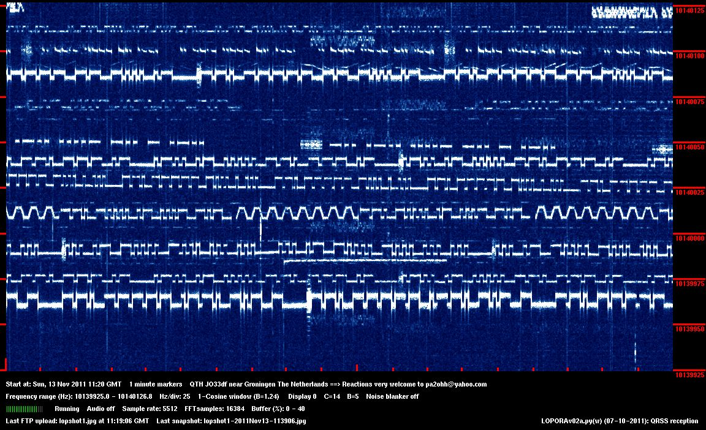
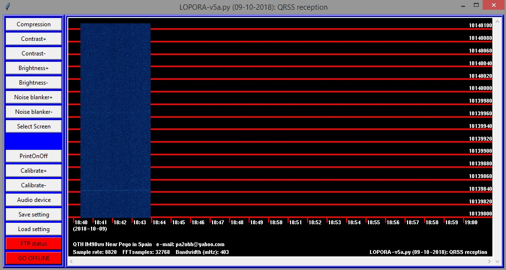

# Lopora
Lopora is a QRSS Beacon Reception Program for Python written by [Onno (PA2OHH)](qsl.net/pa2ohh/index.html). Source code and documentation was copied to GitHub from the [Lopora webpage](https://www.qsl.net/pa2ohh/11lop.htm).

### Features
* Open source and cross-platform (Python)
* Can be run from a console (supports Raspberry Pi)

### Documentation
* [Configuring and Running Lopora](/doc/)
  * [Installing Lopora on Linux Mint](/doc/install-linux.md)
  * [Installing Lopora on Raspberry Pi](/doc/install-raspi.md)
  * [Installing Lopora on Windows 8](/doc/install-windows8.md)

### Sample Output

### Screenshot

